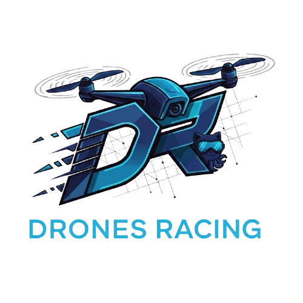
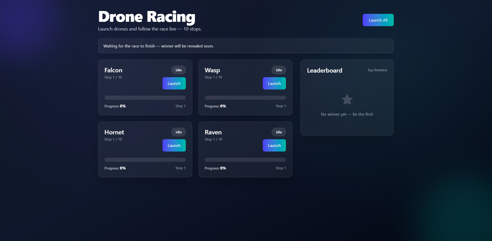
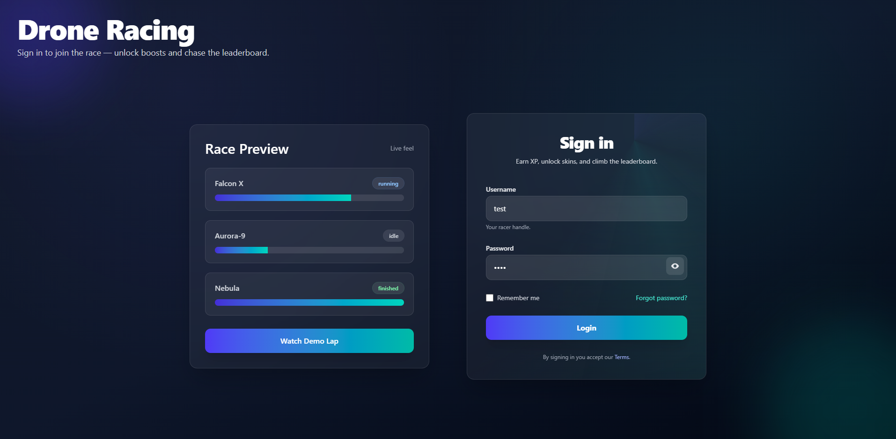
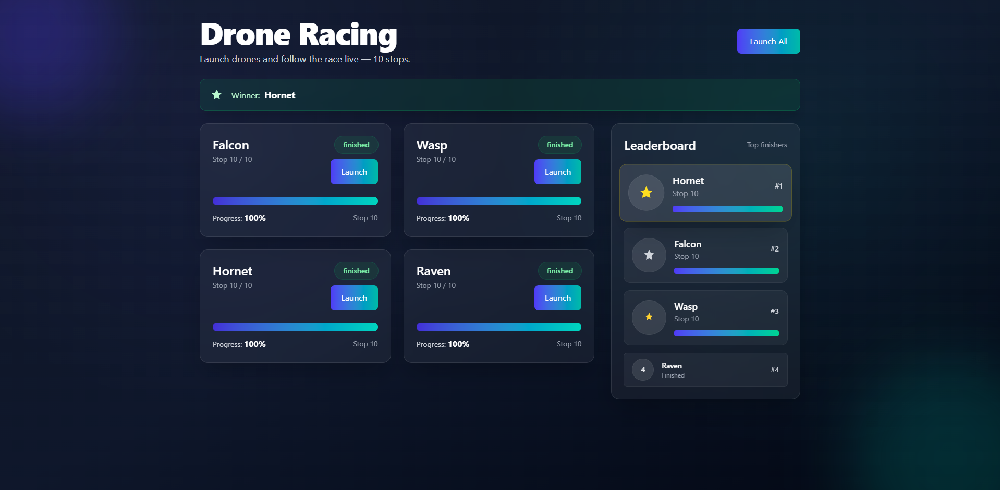
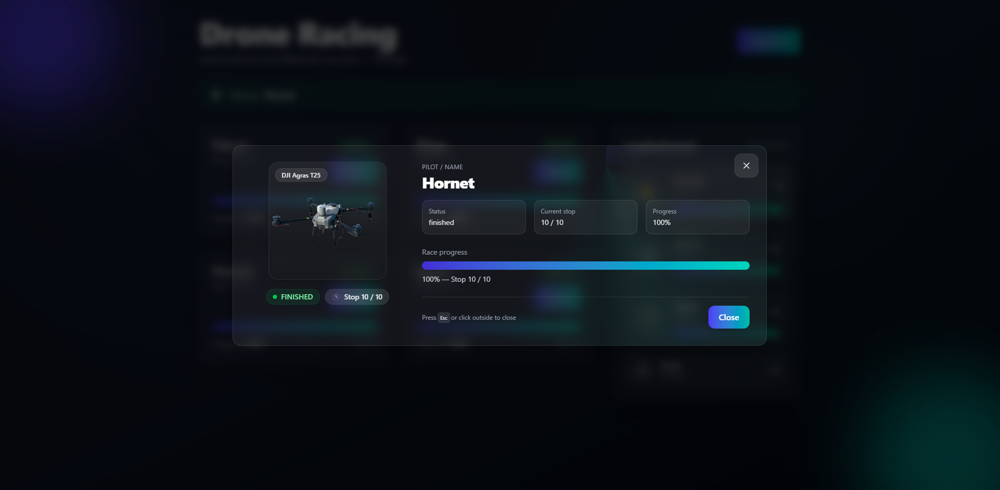

<p align="center">
  
</p>

This is a monorepo managed by [Turborepo](https://turbo.build/repo), containing a drone racing simulator application.

## What's inside?

This monorepo includes the following applications:

- `api`: A NestJS backend that simulates the drone race and streams live updates via Server-Sent Events (SSE).
- `web`: An Angular frontend to visualize the drone race.

### Apps and Packages

Each application is a workspace within the monorepo:

- `api`: Drone Racing API
- `web`: Drone Racing Web UI

## System Requirements

- Node.js 22+
- npm 11+ (or your preferred package manager like `pnpm` or `yarn`)

## Getting Started

Follow these steps to get the project up and running on your local machine.

### 1. Installation

From the root of the project, install all dependencies for both `api` and `web` applications:

```bash
npm install
```

### 2. Running in Development Mode

To start both the `api` and `web` applications in development mode with hot-reloading, run the following command from the root directory:

```bash
npm run start
```

This will use Turborepo to run the `start` script for each application in parallel.

- The **API** will be available at `http://localhost:3000`.
- The **Web UI** will be available at `http://localhost:4200`.

## Screenshots



<table>
  <tr>
    <td></td>
    <td></td>
    <td></td>
  </tr>
</table>